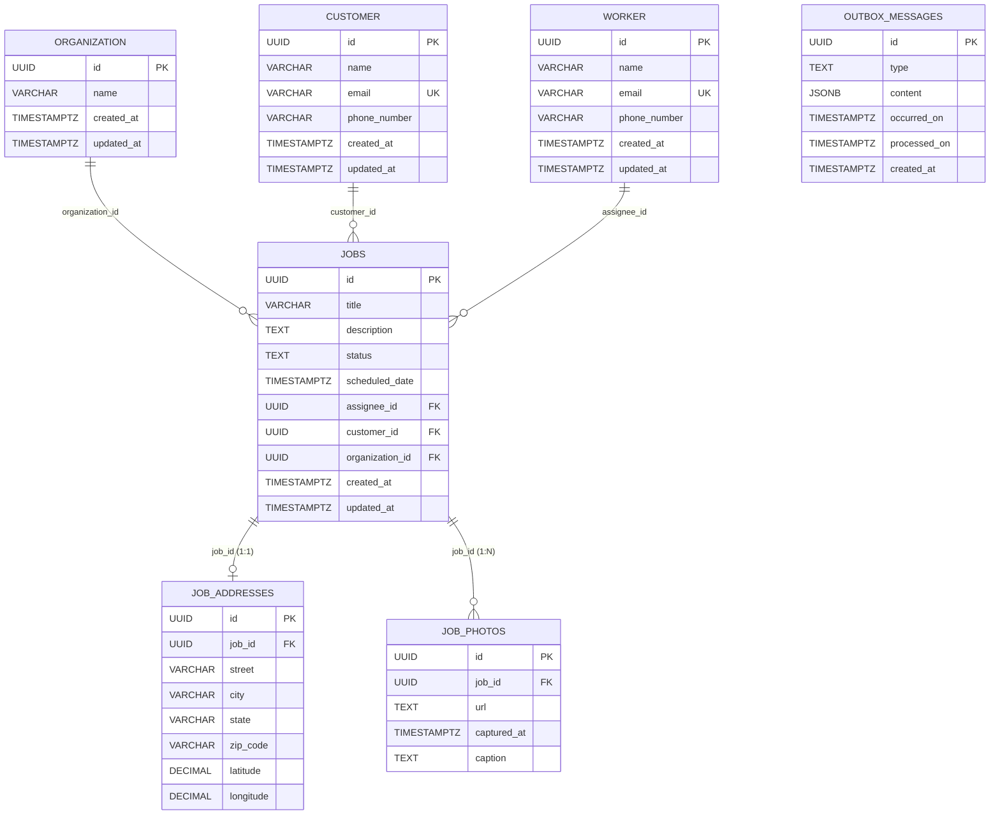

# roofingjobtracker
a Roofing job tracker system for portfolio project


## 0 -- Domain + architecture sketch

local deployment via /docker/docker-compose.yml file

```text

┌───────────────────────────────────────────────────┐
│                  Docker Compose Network           │
│                                                   │
│    ┌────────────┐                                 │
│    │  FrontEnd  │                                 │
│    │ (Next.js)  │                                 │
│    └──────┬─────┘                                 │
│           │                                       │
│  ┌────────┴─────────────────────────┐             │
│  │  ┌─────┴─────┐  ┌──────────────┐ │             │
│  │  │ .Net Api  │=>│ HangfireJobs │ │             │
│  │  │           │  │              │ │             │
│  │  └─────┬─────┘  └──────────────┘ │             │
│  └────────┐─────────────────────────┘             │
│    ┌──────┴─────┐                                 │
│    │            │                                 │
│    │ PostgresDB │                                 │
│    └────────────┘                                 │
└───────────────────────────────────────────────────┘

```

## 1 -- Database Design with PostgreSQL
Postgres version: 18
GUID generator : gen_random_uuid()
Database extensions: pgcrypto for GUID generation
SQL script: /database/init.sql



## 2 -- .NET Modular Monolith with DDD 
## 2.1 -- Monolith Foundation (Solution setup, Clean Architecture projects, DI)
## 2.2 -- Job aggregate + value objects + domain events
## 2.3 -- CQRS + MediatR + validation + repository
## 2.4 -- Outbox + Hangfire + integration events
## 2.5 -- Backend Unit Tests
## 3 -- TypeScript Deep Dive
## 4 -- Next.js Architecture and Patterns
## 4.1 -- FSD Architecture + Server/Client boundary 
## 4.2 -- Zustand store + React Design Patterns
## 4.3 -- Frontend Unit Tests
## 5 -- Testing & Bugfixing, instead of testing since testing was implemented in the previous steps
## 6 -- System Design + README + docker